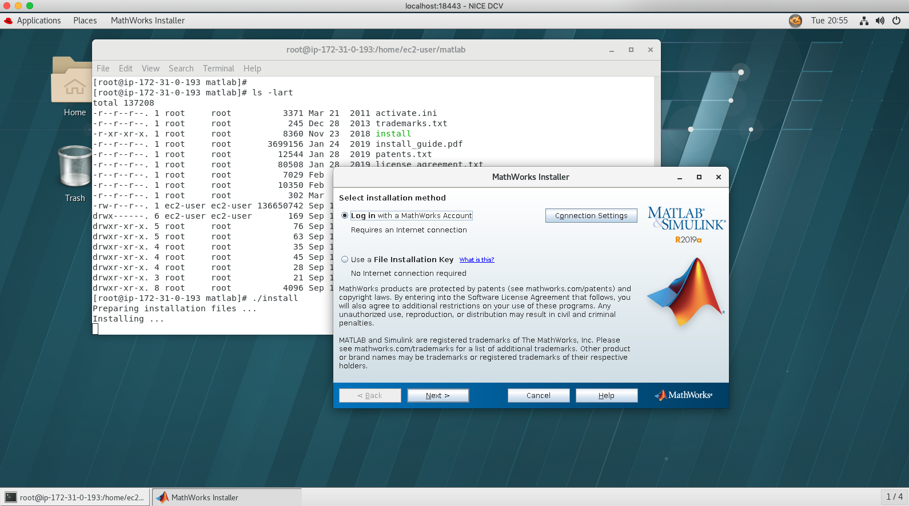
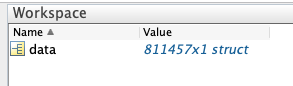
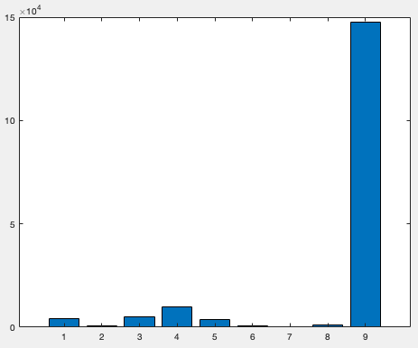
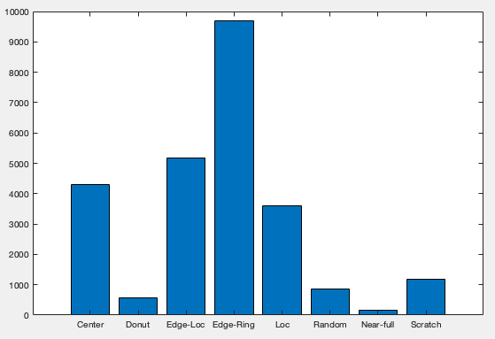
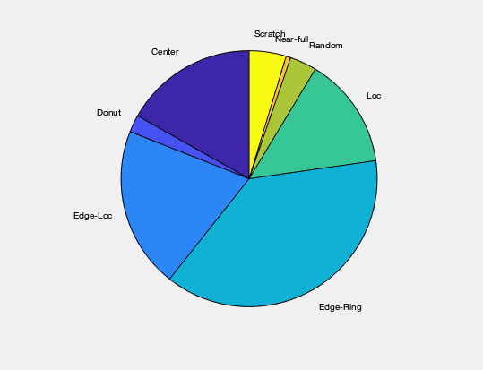
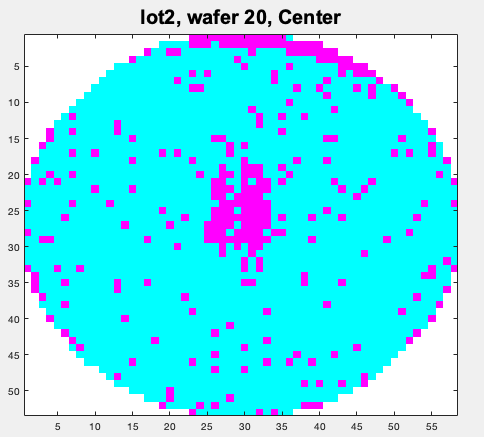

= Wafer Data Analysis of WM811K on AWS
:toc:

This workshop goes the process of first launching an EC2 instance, then downloading and analyzing semiconductor wafer data (<<MIR_LAB>>) for the purposes of understanding how a foundry can better predict and prevent failures more quickly.

The data analysis can be done with several tools, we start with MATLAB and then move to Python later in the workshop. The initial dataset is so large, that using MATLAB to first isolate just the data we are interested allows for speedy access when using Python.

== Launch MATLAB on AWS

Before you can analyze the wafer data, you will need access to MATLAB. You can either use the MathWorks reference architecture, or you can launch an instance, install DCV, and install MATLAB yourself.

=== Option 1: Install MATLAB on instance with DCV

Using DCV (included in EC2 pricing at no charge) to connect to your instance will a provide fast, reliable remote desktop connection for using MATLAB. Once you have launched your instance, you can follow the directions on the https://docs.aws.amazon.com/dcv/latest/adminguide/what-is-dcv.html[NICE DCV] site to setup DCV on your instance. You should now connect to your instance with the DCV Remote Desktop. You will also need to copy the MATLAB install file (zip file) to the instance and install MATLAB. You will get prompted for your account and license information, and you should see something like this when you run the `install` command included in the MATLAB install file:

=== Option 2: Use the MathWorks AWS Reference Architecture

MathWorks has provided a reference architecture and GitHub repo with detailed instructions for launching an EC2 instance with MATLAB installed. You will need a license, and if needed a trial can be found here: https://www.mathworks.com/campaigns/products/trials.html[MATLAB Trial]

Here are some resources that MathWorks has provided to launch MATLAB:

* https://www.mathworks.com/cloud/aws.html[MATLAB on Amazon Web Services]
* https://github.com/mathworks-ref-arch/matlab-on-aws[MATLAB on AWS GitHub repo]
* https://www.mathworks.com/videos/how-to-run-matlab-in-the-cloud-with-amazon-web-services-1542634996553.html[Instructional Video for Launching MATLAB on AWS.]

== Download the WM-811K data

The wafer data is the WM-811K data set which consists of 811,457 wafer maps, and is real data from a actual foundry. This data set available for public download:

- <<MIR_Lab>> (link to data in References)

== Explore the data using MATLAB

Once you have the WM811K.mat file (from the download above), you can launch MATLAB.

=== Load the .mat file

Once you have launched MATLAB, you can load the WM811K.mat file. This will take some time, as this is large file:

....
>> load(path/to/WM811K.mat)
....

Once the file is loaded, you should see `data` in the workspace (right side):

This shows that there are **811,457** elements in the `data` struct, or for us we know that is **811,457** wafers.

=== Explore the wafer data

The data file that was downloaded has an example MATLAB command file, `example.m`.  Some of the MATLAB commands used in this workshop are from that file.

==== Get a list of each of the field names in the data struct:
....
>> f_names = fieldnames(data(1));
>> disp(f_names)
    'waferMap'
    'dieSize'
    'lotName'
    'waferIndex'
    'trainTestLabel'
    'failureType'
....

==== Get the total number of wafers:
....
>> totalWafers=length(data)

totalWafers =

      811457
....

==== Get the last lot number:
....
>> lastLot=data(end).lotName

lastLot =

    'lot47543'
....

==== Show the wafer failure types:
....
>> %% Select training and test data
trainTestLabel={data.trainTestLabel};
trainIdx=find(strcmp(trainTestLabel,'Training'));
testIdx=find(strcmp(trainTestLabel,'Test'));

>> %% Show each failure type
failureType={data.failureType};
trainFailureType=failureType(trainIdx);
testFailureType=failureType(testIdx);
waferFailType=unique(trainFailureType);

>> disp(waferFailType)
    'Center'    'Donut'    'Edge-Loc'    'Edge-Ring'    'Loc'    'Near-full'    'Random'    'Scratch'    'none'
....

Now we have our wafer failure types:

__Center, Donut, Edge-Loc, Edge-Ring, Loc, Near-full, Random, Scratch, and none__

==== Graph and compare the data

Set the totals for each failure type, and then we can graph the results:

....
%% Get totals for each type
center = find(strcmp({data.failureType},'Center'));
donut = find(strcmp({data.failureType},'Donut'));
edgeLoc = find(strcmp({data.failureType},'Edge-Loc'));
edgeRing = find(strcmp({data.failureType},'Edge-Ring'));
loc = find(strcmp({data.failureType},'Loc'));
random = find(strcmp({data.failureType},'Random'));
nearFull = find(strcmp({data.failureType},'Near-full'));
scratch = find(strcmp({data.failureType},'Scratch'));
none = find(strcmp({data.failureType},'none'));
....

**Bar chart**

Let's start comparing the data, with a bar chart. This first one we will use all of the failure types.
....
%% All defect types
y = [length(center) length(donut) length(edgeLoc) length(edgeRing) length(loc) length(random) length(nearFull) length(scratch) length(none)]
bar(y)
....
You should see something like this:

{nbsp}

Clearly, this shows that the failure type **none** is skewing the results. So let's work without it for now.

**Bar chart without "none" and add labels**

Make a bar chart without the **none** failure type and add labels:
....
%% bar chart with labels
y = [length(center) length(donut) length(edgeLoc) length(edgeRing) length(loc) length(random) length(nearFull) length(scratch)]
labels = {'Center', 'Donut', 'Edge-Loc', 'Edge-Ring', 'Loc', 'Random', 'Near-full', 'Scratch'}
x = [1:8]
bar(x,y)
set(gca,'xticklabel',labels)
....

{nbsp}

This shows that the most failures occure with the failure type of **Edge-Ring**, and the fewest are **Near-full**.

**Pie chart with labels**

For even more clarity, we make a pie chart with labels:
....
y = [length(center) length(donut) length(edgeLoc) length(edgeRing) length(loc) length(random) length(nearFull) length(scratch)]
pie(y, {'Center', 'Donut', 'Edge-Loc', 'Edge-Ring', 'Loc', 'Random', 'Near-full', 'Scratch'})
....

{nbsp}

=== Look at a wafer map

This shows a image of a wafer, by setting the failure type, it shows just the first index (1):

....
%% Plot a wafer map
failTypeSearch='Center';
idx=find(strcmp(trainFailureType,failTypeSearch));
exampleIdx=trainIdx(idx(1));
waferMap=data(exampleIdx).waferMap;
imagesc(waferMap);
selfColorMap=[ 1 1 1; ... % empty elements use white color
             0 1 1 ; ... % good dice use cyan color
             1 0 1 ];    % defective dice use magenta color
colormap(selfColorMap);
wafer_title = data(exampleIdx).lotName + ", wafer " + data(exampleIdx).waferIndex + ", FailType: " + data(exampleIdx).failureType;
title(wafer_title,'FontWeight','bold','FontSize',20,'FontName','Arial');
....

You should see a wafer map similar to this:

{nbsp}

== Moving to Python

=== Get only needed data from MATLAB

Before we can switch to Python, it's worth going through the data MATLAB and pulling out only what is needed. This reduces the dataset and makes it more manageable in Python.

This produces a dataset that only includes the label failure types, as many of the wafers are not labeled.

....
>> filename = 'test-save.mat';
>> save('test-save.mat', data(1) , '-v7.3')

clearvars export_data
clearvars export_data_r
export_data = [];
for i = 1:811457
fail_ck=size(data(i).failureType);
if fail_ck == 0
    continue
else
    export_data = [export_data, data(i)];
end
end
export_data_r = export_data';

....

If we look at refined data closer, we see have a total of 172,950 wafers that are labeled with a failure type:

....
>> disp(length(export_data_r));
      172950
....

If we compare this to data for each failure type that we captured above:
....
>> fail_label = {'center'; 'donut'; 'edgeLoc'; 'edgeRing'; 'loc'; 'random'; 'nearFull'; 'scratch'; 'none'; 'TOTAL'};
fail_values = [length(center); length(donut); length(edgeLoc); length(edgeRing); length(loc); length(random); length(nearFull); length(scratch); length(none); sum(y)];
format long
T = table(fail_values,'RowNames', fail_label);
disp(T);
                fail_values
                ___________

    center          4294
    donut            555
    edgeLoc         5189
    edgeRing        9680
    loc             3593
    random           866
    nearFull         149
    scratch         1193
    none          147431
    TOTAL         172950
....

Looking at **TOTAL**, it looks like we have the right data.

=== Save data to a file

....
>> filename = 'WM811K-failures_only.mat';
>> save('WM811K-failures_only.mat', 'export_data_r', '-v7.3')
....

=== Open the MATLAB file in python

Let's have a quick look at the data, the `read_mat` will take some time (maybe we should reduce the dataset again?). We know our fields should be **waferMap, dieSize, lotName, waferIndex, trainTestLabel, and failureType**. Let's check that the last wafer for good data but only showing the first 20 chars. The last wafer is index 172949, because arrays start at 0 in python.
....
$ python
Python 2.7.15 (v2.7.15:ca079a3ea3, Apr 29 2018, 20:59:26)
[GCC 4.2.1 Compatible Apple LLVM 6.0 (clang-600.0.57)] on darwin
Type "help", "copyright", "credits" or "license" for more information.
>>> import sys
>>> import numpy as np
>>> from pymatreader import read_mat
>>> wafer_data = read_mat('WM811K-failures_only.mat')
>>> type(wafer_data)
<type 'dict'>
>>> fields = ['waferMap', 'dieSize', 'lotName', 'waferIndex', 'trainTestLabel', 'failureType']
>>> for f in fields:
...     print f, str(wafer_data['export_data_r'][f][172949])[:20]
...
waferMap [u'\x00\x00\x00\x00\
dieSize 600.0
lotName lot47542
waferIndex 25.0
trainTestLabel Test
failureType Edge-Ring
....

Okay looks good.

Let's get a look at the wafer map:

....
>>> def build_wafer_map(wafer_map_data):
...     wafer_list = list()
...     for line in wafer_map_data:
...         line = repr(line.encode('ascii'))
...         line = line.replace("\'","")
...         line = line.split('\\x0')
...         while("" in line) :
...             line.remove("")
...         wafer_list.append(line)
...     return wafer_list
...
>>> wafer_map_data = build_wafer_map(wafer_data['export_data_r']['waferMap'][172949])
>>> for l in wafer_map_data:
...     print(' '.join(l))
...
0 0 0 0 0 0 0 0 0 0 0 1 2 1 1 1 1 1 0 0 0 0 0 0 0 0 0 0 0 0
0 0 0 0 0 0 0 0 2 1 1 1 1 1 2 1 1 2 1 1 1 0 0 0 0 0 0 0 0 0
0 0 0 0 0 0 1 1 1 2 1 2 1 1 2 1 1 1 1 1 1 1 1 0 0 0 0 0 0 0
0 0 0 0 0 1 1 1 1 1 1 1 1 1 1 1 1 1 1 2 1 1 1 1 1 0 0 0 0 0
0 0 0 0 1 1 1 1 2 1 1 1 1 1 1 1 1 1 1 1 1 1 1 1 1 2 0 0 0 0
0 0 0 1 1 1 1 1 1 1 1 1 1 1 1 1 1 1 1 1 1 1 1 1 1 1 2 0 0 0
0 0 2 2 1 1 1 1 1 1 1 1 1 1 1 1 1 1 1 1 1 1 1 1 1 1 1 2 0 0
0 0 1 1 1 1 1 1 1 1 2 1 1 1 1 1 1 2 2 1 1 1 1 1 1 1 1 2 0 0
0 1 1 1 1 1 1 1 1 1 1 1 1 1 1 1 1 1 2 1 1 1 1 1 1 1 1 1 2 0
0 2 2 1 1 1 1 1 1 1 1 1 1 1 1 1 1 1 1 1 1 1 1 1 1 1 1 2 1 0
2 1 1 1 1 1 1 1 1 1 1 1 1 1 1 1 1 1 1 1 1 1 1 2 1 1 1 1 2 0
2 1 1 1 1 1 1 1 2 1 1 1 1 1 1 1 1 1 1 1 1 1 1 2 2 1 1 1 1 2
2 1 1 1 1 1 1 1 1 1 2 1 1 1 1 2 1 1 1 1 1 1 1 1 1 1 1 1 1 2
2 1 1 1 1 1 1 1 1 1 1 1 1 2 1 1 1 1 1 1 1 1 1 1 1 1 1 1 2 2
2 1 1 2 1 1 1 1 1 1 1 1 1 1 1 1 1 1 1 1 1 1 1 1 1 1 1 1 2 2
2 2 1 1 2 1 1 1 1 1 1 1 1 1 1 1 1 1 1 1 1 1 1 1 1 1 1 1 2 0
0 2 1 1 1 1 1 2 1 1 1 1 1 1 1 1 1 1 1 1 1 1 1 1 1 1 1 1 2 0
0 2 2 1 1 1 1 1 1 1 2 1 1 1 1 1 1 1 1 1 1 1 1 1 1 1 1 2 2 0
0 0 2 1 1 1 1 1 1 1 1 1 1 1 1 1 1 1 2 1 1 1 1 1 1 1 1 2 0 0
0 0 2 2 1 1 1 1 1 1 1 1 1 1 1 1 1 1 1 1 1 1 1 1 1 1 2 2 0 0
0 0 0 2 1 1 1 1 1 1 1 1 1 1 1 1 1 1 1 1 1 1 1 1 2 2 2 0 0 0
0 0 0 0 2 1 1 1 1 1 1 1 1 1 1 2 1 1 1 1 1 2 1 1 1 2 0 0 0 0
0 0 0 0 0 2 2 1 1 1 1 1 1 1 1 1 1 1 1 1 1 1 1 2 2 0 0 0 0 0
0 0 0 0 0 0 2 1 1 1 1 1 1 1 1 1 1 1 1 1 1 1 1 0 0 0 0 0 0 0
0 0 0 0 0 0 0 0 2 2 1 1 1 2 1 1 1 1 1 2 1 0 0 0 0 0 0 0 0 0
0 0 0 0 0 0 0 0 0 0 0 2 2 2 2 2 2 2 0 0 0 0 0 0 0 0 0 0 0 0
....

Look familiar? If you look close you can see 2's in several places, indicating a non-functional die. And the non-fucntional die agree with the failure type "Edge-Ring" we see above.

[bibliography]
== References

- [[[MIR_Lab]]] Data Set [WM-811K(LSWMD)] http://mirlab.org/dataSet/public/

